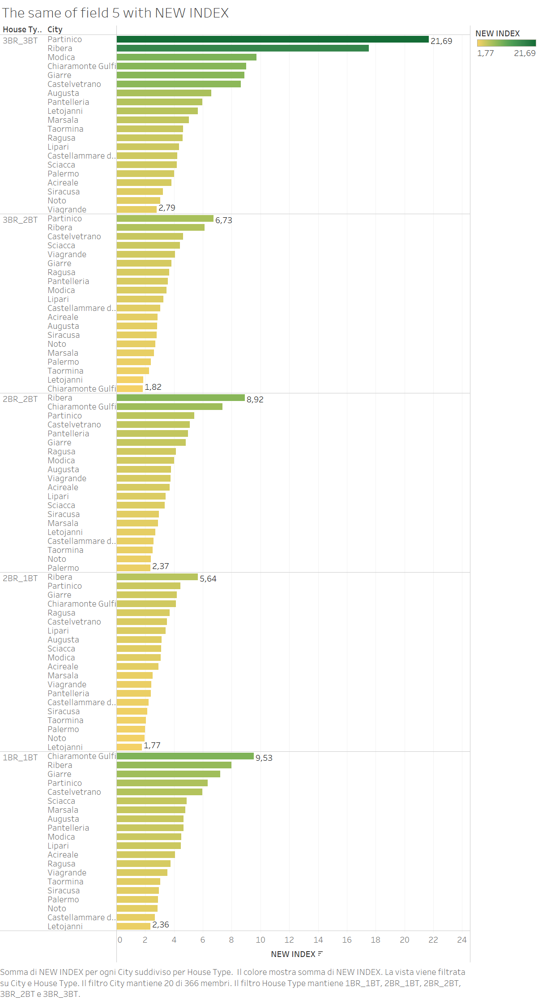

# Airbnb Investment Analytics ETL & BI Dashboard

This repository presents an ETL and BI workflow built around Airbnb and real-estate market data in Sicily. The project integrates multiple Excel and CSV sources, prepares analytical outputs in Tableau Prep, and delivers Tableau Desktop assets plus a browser-based dashboard reconstruction for ROI analysis, occupancy-rate evaluation, and location-level investment decision support.

Tools & Stack: Tableau Prep | Tableau Desktop | Excel | CSV | ETL | BI Analytics

## Executive Summary

The project evaluates short-term rental potential across Sicilian cities and property types by combining Airbnb listing data, housing market benchmarks, and occupancy assumptions. The result is a prepared dataset, a Tableau-based analytical layer, and a recruiter-friendly browser dashboard that support comparison between Airbnb-style income potential and more traditional rental performance.

## Business Problem

Investors and analysts need a structured way to compare where short-term rental opportunities may outperform traditional rent. Raw data alone is fragmented across listing-level sources, market reference tables, and occupancy assumptions. This project addresses that by creating a repeatable ETL pipeline and a dashboard-ready analytical output.

## Report

Public report:

- [airbnb_investment_analytics_report.pdf](reports/airbnb_investment_analytics_report.pdf)

The original academic PDF is retained only as a private reference and is not intended for public publication.

## Data Sources

The repository includes the main public-safe source files used in the workflow:

- `data/raw/airbnb_price.xlsx`
- `data/raw/house_info.xlsx`
- `data/raw/cities_in_sicily.xlsx`
- `data/raw/cities_in_sicily_buy_rent.xlsx`
- `data/raw/occupancy_rate_by_city.xlsx`
- `data/raw/listings_sample_public.csv`

The full `listings.csv` file is excluded from Git tracking for privacy and publication reasons. A sampled public-safe version is provided instead to demonstrate the ETL/BI workflow without exposing host identifiers or exact coordinates.

## ETL Workflow

The ETL pipeline is implemented in Tableau Prep and follows a business-oriented transformation flow:

1. Ingest Airbnb, property, and city-level benchmark sources.
2. Clean and standardize fields used for joins and downstream analysis.
3. Join listing-level and city-level information into unified analytical outputs.
4. Calculate investment metrics such as annual Airbnb revenue, rent benchmarks, ROI-oriented comparison fields, and occupancy-adjusted views.
5. Export processed outputs for dashboard consumption in Tableau Desktop.

See [etl_workflow.md](docs/etl_workflow.md) for the documented pipeline logic.

## Tableau Prep Pipeline

Included pipeline assets:

- `tableau/prep/airbnb_investment_pipeline_final.tfl`
- `tableau/prep/airbnb_investment_pipeline_early_version.tfl`
- `tableau/prep/airbnb_investment_pipeline_final_repo_safe.tfl`
- `tableau/prep/airbnb_investment_pipeline_early_version_repo_safe.tfl`

The `repo_safe` variants are the recommended starting point for validation inside the cleaned repository because they already replace the original machine-specific input and output references where a safe automatic mapping was possible.

## Dashboard Overview

Included Tableau Desktop assets:

- `tableau/dashboards/airbnb_investment_analytics_dashboard.twb`
- `tableau/dashboards/occupancy_sensitivity_dashboard.twb`

The dashboards focus on:

- city-level listing concentration
- property-type segmentation
- rent vs Airbnb yield comparison
- occupancy-adjusted performance views
- comparative decision support for investment screening



See [dashboard_logic.md](docs/dashboard_logic.md) for the documented dashboard structure.

## Dashboard Access

There are three ways to review the dashboard layer:

- Browser dashboard reconstruction: `dashboard_preview/index.html`
- PDF report: `reports/airbnb_investment_analytics_report.pdf`
- Tableau files: `tableau/prep/` and `tableau/dashboards/` for users with Tableau Prep or Tableau Desktop

The browser dashboard reconstructs the Final Dashboard / Step 4 Tableau logic and can be reviewed without a Tableau license. The interactive Tableau dashboard can be republished to Tableau Public only after validating the workbook connections and confirming that all underlying data is public-safe.

## Key Metrics

The project centers on metrics such as:

- Airbnb YROI
- Rent YROI
- annual Airbnb rent / revenue
- annual rent benchmark
- occupancy-adjusted comparisons
- city-level and property-type performance indicators

## Repository Structure

```text
airbnb-investment-analytics-etl-bi-dashboard/
|-- data/
|   |-- raw/
|   `-- processed/
|-- dashboard_preview/
|-- tableau/
|   |-- prep/
|   `-- dashboards/
|-- docs/
|-- evidence/
|   `-- screenshots/
|-- outputs/
|-- reports/
|-- .gitignore
|-- CLEANUP_SUMMARY.md
|-- FINAL_PUBLICATION_REVIEW.md
`-- README.md
```

## How to Reproduce

1. Open the interactive browser dashboard in `dashboard_preview/index.html`.
2. Review the Final Dashboard reconstruction logic described in `dashboard_preview/README.md`.
3. Open the `repo_safe` Tableau Prep flow in `tableau/prep/`.
4. Validate or remap input file paths to the local copies under `data/raw/`.
5. Compare the outputs against:
   - `data/processed/airbnb_investment_dataset_final.xlsx`
   - `data/processed/occupancy_sensitivity_dataset.xlsx`
6. Open the Tableau Desktop workbooks in `tableau/dashboards/`.
7. Validate that the workbook data connections resolve correctly inside your local clone.

## Technologies Used

- Tableau Prep
- Tableau Desktop
- Excel
- CSV-based source integration
- ETL pipeline design
- BI dashboard development

## Limitations

- The Tableau files were updated for better portability, but they still require manual validation inside Tableau.
- The old static screenshot-only preview has been replaced by an interactive browser dashboard that reconstructs the Final Dashboard / Step 4 logic from the cleaned processed datasets.
- The public report has a sanitized portfolio cover page, but pages 2 onward still preserve the original report body and may contain legacy classroom-style phrasing.
- The repository includes selected main datasets and outputs, not every historical intermediate version from the original working folder.
- `calendar.csv` was intentionally excluded because it is extremely large and not necessary for a clean GitHub portfolio package.
- The full `listings.csv` file is intentionally excluded from Git tracking; the repository ships with a public-safe sampled version instead.

## Future Improvements

- validate the `repo_safe` Tableau Prep and Tableau Desktop assets directly in Tableau
- add a field-level data dictionary for the processed outputs
- document KPI formulas directly from the final Tableau workflow
- export additional curated dashboard previews
- publish a Tableau Public version only after confirming public-safe data inputs

For publication-specific considerations, see [publication_notes.md](docs/publication_notes.md), [tableau_portability_notes.md](docs/tableau_portability_notes.md), and [FINAL_PUBLICATION_REVIEW.md](FINAL_PUBLICATION_REVIEW.md).
